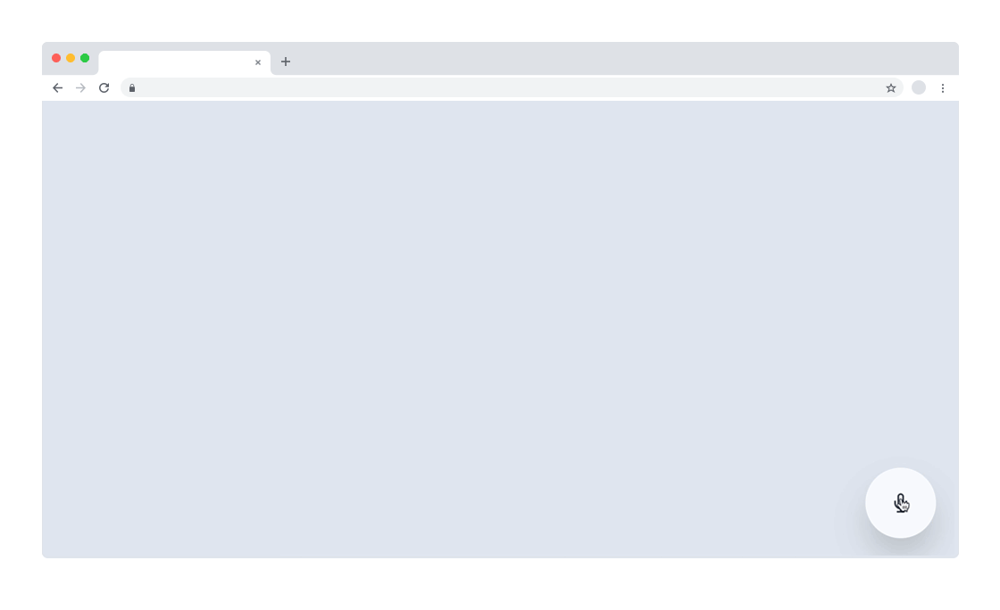
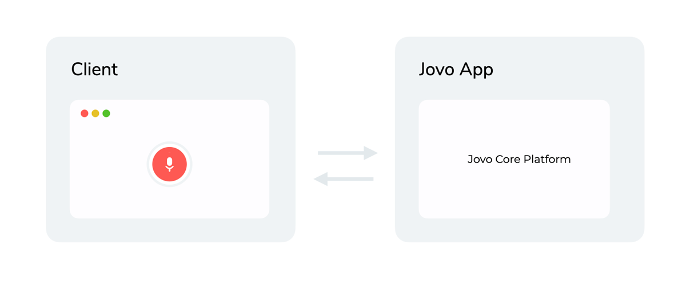

# Jovo Web Starter: Voice Overlay

Fully customizable open source microphone widget to add voice interactions to your web app or website.

Built with the [Jovo Framework](https://github.com/jovotech/jovo-framework), [Vue.js](https://github.com/vuejs/vue), and [Tailwind CSS](https://github.com/tailwindlabs/tailwindcss).

Demo: [jovo.tech/demos/starter-web-overlay](https://www.jovo.tech/demos/starter-web-overlay/).



> Support Jovo by starring [our main repo](https://github.com/jovotech/jovo-framework) or joining [our Open Collective](https://opencollective.com/jovo-framework).

- [Getting Started](#getting-started)
- [How it works](#how-it-works)
- [Customization](#customization)
  - [Client](#client)
  - [App](#app)


## Getting Started

1.  **Download starter**

    Use the Jovo CLI to create a new project based on this starter:

    ```sh
    # Install latest version of the Jovo CLI
    $ npm i -g jovo-cli

    # This will download the template and install the dependencies
    $ jovo new my-embeddedchat --template starter-web-embeddedchat

    $ cd my-embeddedchat
    ```
    Alternatively, you can clone this repository and run `npm install`.


2. **Start client (Vue.js)**
   ```sh
    $ cd client

    # Start Vue frontend
    $ npm run serve
    ```
3. **Start app (Jovo)**
    In a new tab:

    ```sh
    $ cd app

    # Start Jovo development server
    $ jovo run
    ```
    The first time, `jovo run` will compile the TypeScript code. After making changes, make sure to compile with `npm run tsc` and then start the Jovo development server again.

4. **Open the starter in your browser at `http://localhost:8080`.**

    > Note: For demo purposes and the ease of getting started quickly, the template uses the [Web Speech API](https://wicg.github.io/speech-api/) as an ASR, which only works in Google Chrome. To use the Web integration on other browsers, you can integrate one of our integrations of several [cloud ASRs](https://www.jovo.tech/marketplace/tag/asr).


## How it works



This repository contains:
* `app`: Backend logic built with the [Jovo Framework](https://github.com/jovotech/jovo-framework) using its [Web Platform integration](https://github.com/jovotech/jovo-framework/tree/master/jovo-platforms/jovo-platform-web).
* `client`: Frontend built with [Vue.js](https://vuejs.org/) and [Tailwind CSS](https://tailwindcss.com/), communicating with the backend using the [Jovo Web Client for Vue.js](https://github.com/jovotech/jovo-framework/tree/master/jovo-clients/jovo-client-web-vue).


## Customization

The starter was built for you to have a working example as well as an entry point to get started with the Jovo Web integration.

The following documentation will help you understand how the starter is structured and which components take care of which tasks.

### Client

The client is a Vue.js project that consists of a single component "Overlay" which is styled in Tailwind CSS.

#### Component: Overlay

The Overlay component handles the registration for multiple event listeners, namely `ClientEvent.Request`, `ClientEvent.Response`, and `ClientEvent.Action`.

* `ClientEvent.Request`: triggered before the request is sent out to the Jovo app. In this case, it is used to display the user's speech next to the microphone button.
* `ClientEvent.Response`: triggered when the client receives the Jovo app's response. In this case, it is used to display the app's response.
* `ClientEvent.Action`: triggered when the app's response contains an action. In our case we expect a `set-theme` action notifying us to switch the theme to either dark or light.

Besides that, it implements the logic to switch from dark to light mode as a demo feature, which makes use of [Tailwind's custom variants](https://tailwindcss.com/docs/pseudo-class-variants#creating-custom-variants).

#### Component: OverlayRecordButton

The OverlayRecordButton component handles the basic logic of capturing the user's voice input.

### App

The Jovo app the new [Jovo Web Platform integration](http://jovo.tech/marketplace/jovo-platform-web) as well as [NLP.js](https://www.jovo.tech/marketplace/jovo-nlu-nlpjs) as its NLU.

#### Language Model

The language model consists of a single intent, `SwitchThemeIntent`, used to change the theme of the website to either dark or light mode.

#### app.ts

The `app.ts` file contains the initialization of the app and its plugins as well as the basic logic for the `SwitchThemeIntent`. It makes use of the Web integrations `Custom Actions` to send a `set-theme` action containing the user's input (either `dark` or `light`). The action will trigger the `ClientEvent.Action` listener we've mentioned earlier.